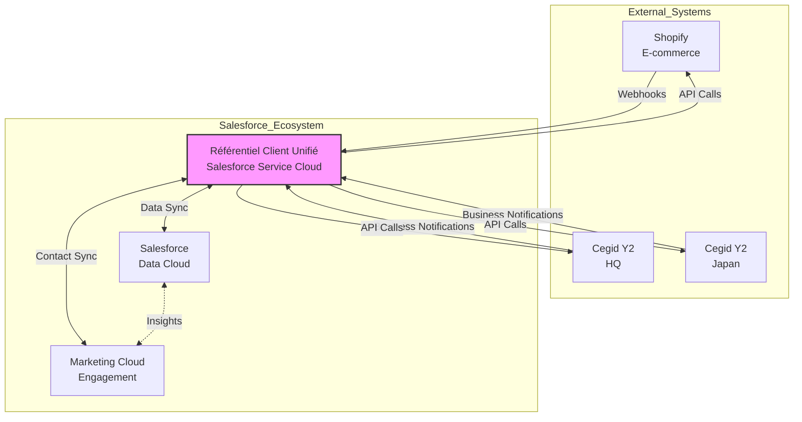
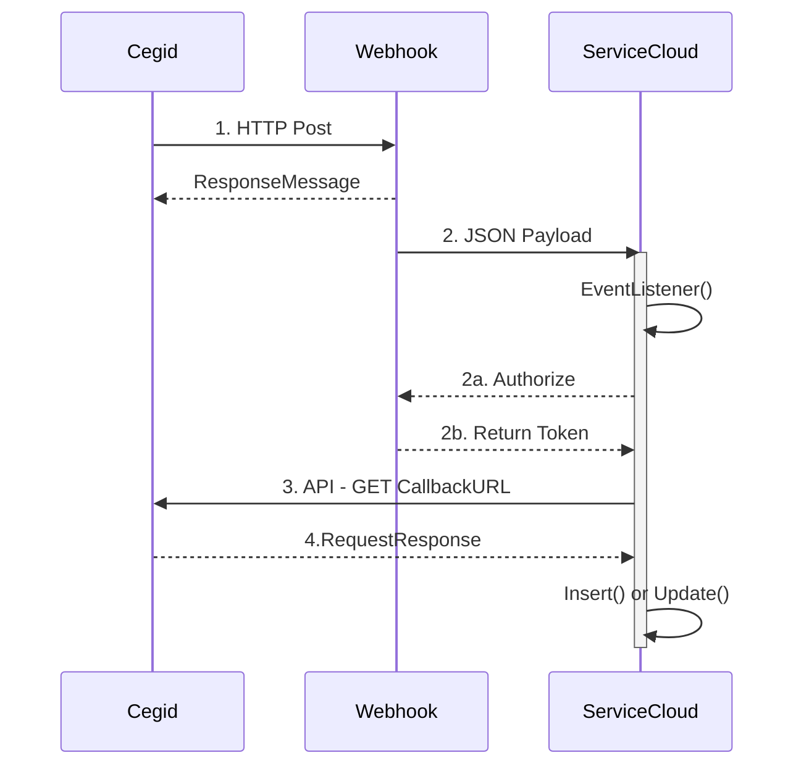
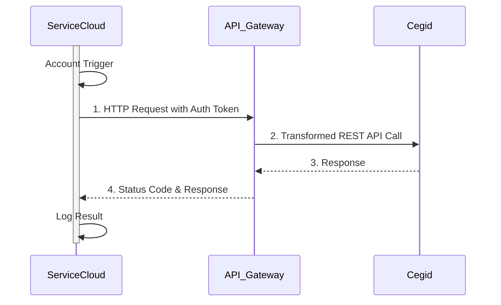
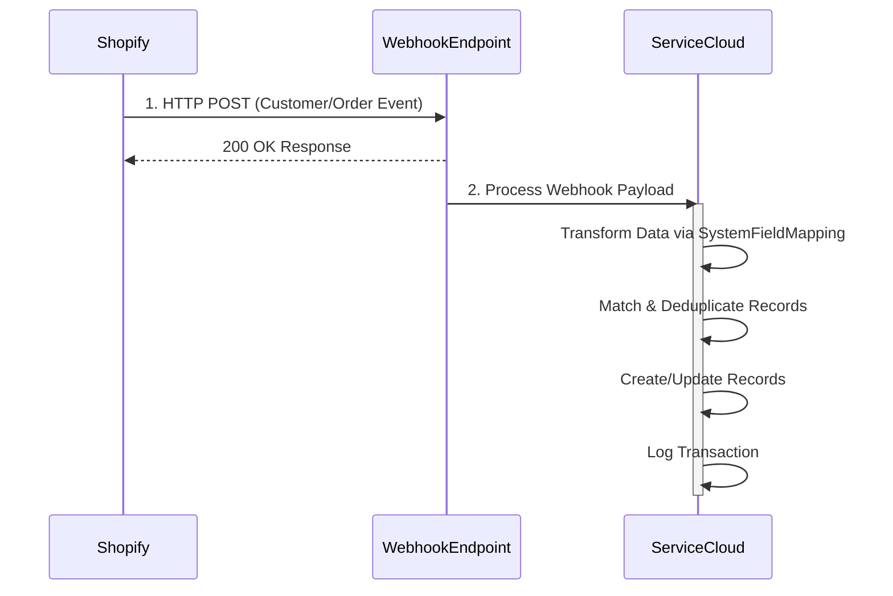
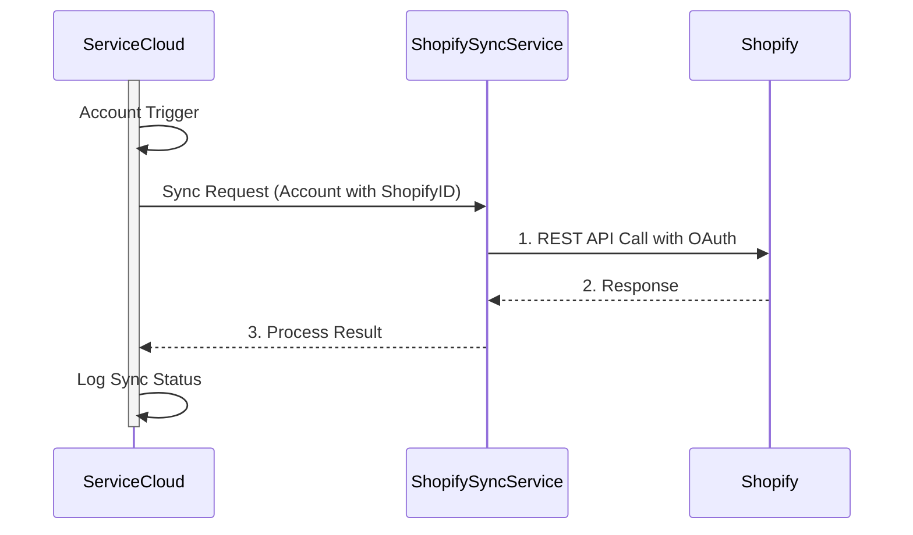
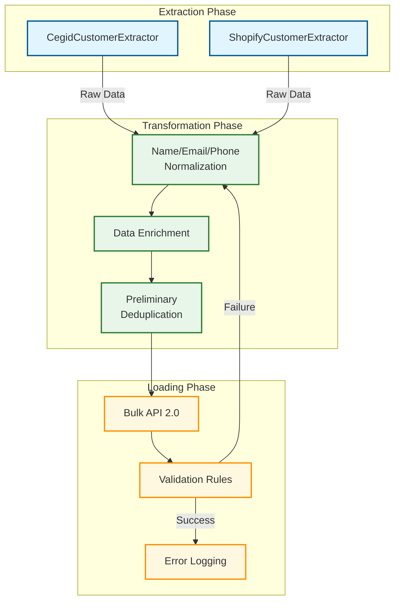
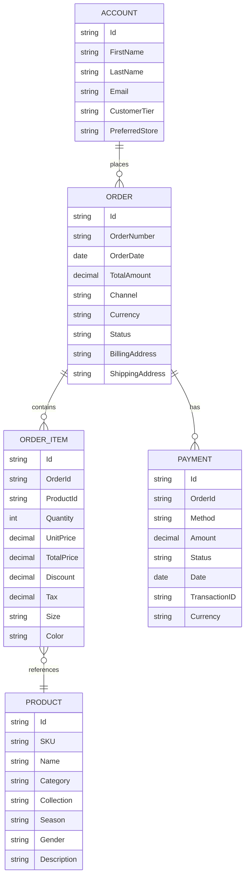
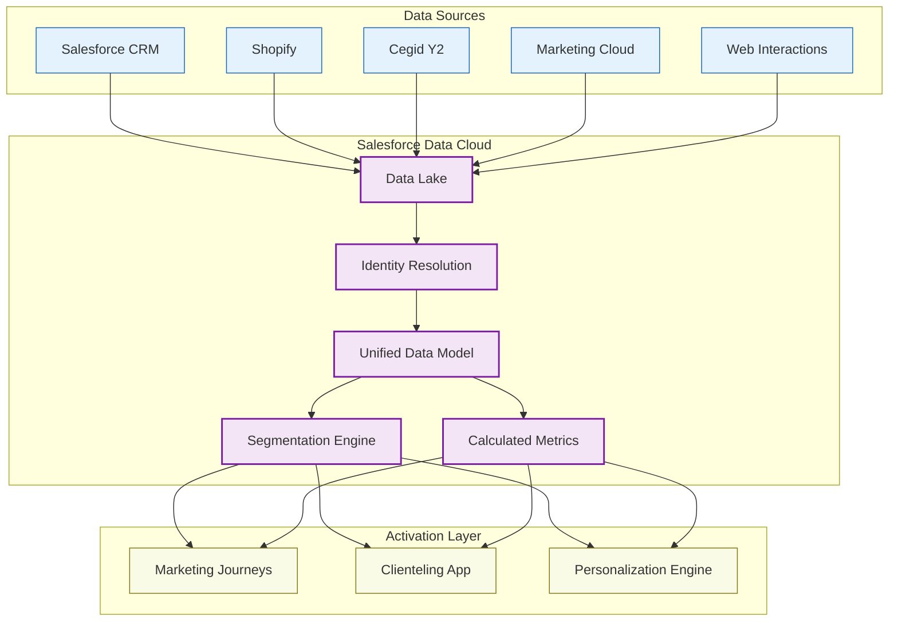
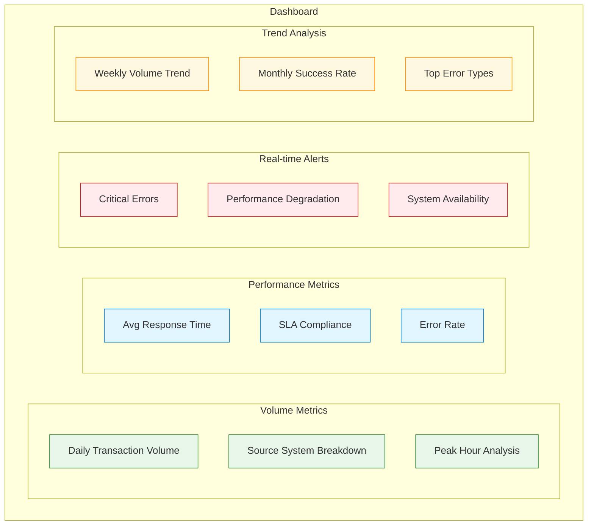

# Mermaid Diagrams for Chapter 4

## AMIgo_Integration_Architecture

## Cegid_to_ServiceCloud_Sequence

## ServiceCloud_to_Cegid_Sequence

## Shopify_to_ServiceCloud_Sequence

## ServiceCloud_to_Shopify_Sequence

## ETL_Process_Flow

## Order_Data_Model

## Data_Cloud_Architecture

## Integration_Monitoring_Dashboard

